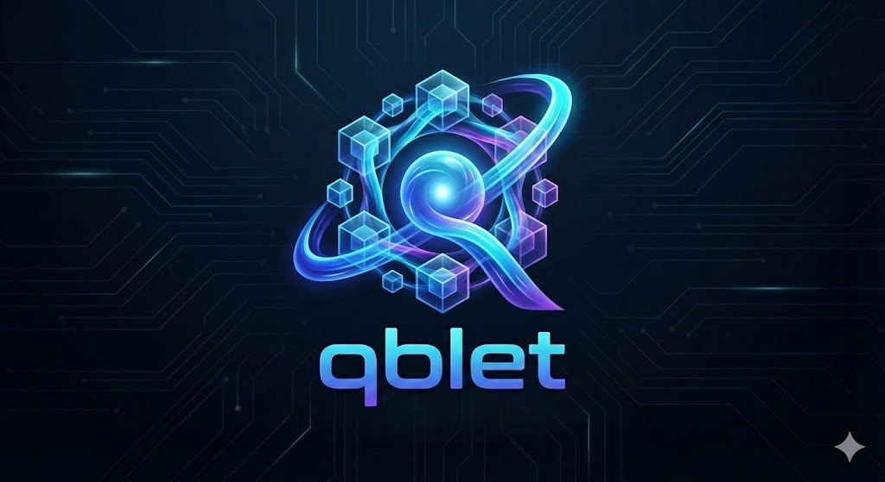

<div align="center">
  
</div>

# Qblet Architecture Standard (v3.1)

[](LICENSE)
[](./docs/SPECIFICATION.md)
[](./docs/CONTRIBUTING.md)

> **"Ni tan pequeño que sea irrelevante, ni tan grande que sea inmanejable. Un Qblet es del tamaño de un Dominio de Negocio."**

**Qblet** es un manifiesto y estándar arquitectónico diseñado para resolver el "Infierno de los Microservicios". Define unidades de software **soberanas**, **autocontenidas** y **sociales** que equilibran la autonomía del equipo con la gobernabilidad del sistema.

---

## � Documentación Oficial

El estándar se compone de los siguientes documentos normativos:

| Documento | Descripción |
| :--- | :--- |
| **[WHITEPAPER](./docs/WHITEPAPER.md)** | **Lectura Obligatoria**. La biblia técnica que define la filosofía, arquitectura y reglas del juego. |
| **[SPECIFICATION](./docs/SPECIFICATION.md)** | Definición formal de requisitos para cumplimiento (Compliance). |
| **[PROTOCOL](./docs/PROTOCOL.md)** | Estandarización de headers HTTP (`X-Qblet-*`) y formatos de error. |
| **[WEBHOOKS](./docs/TRANSPORT_WEBHOOKS.md)** | Especificación del transporte asíncrono P2P y seguridad de eventos. |
| **[SECURITY](./docs/SECURITY.md)** | Modelo Zero Trust, rotación de claves y autenticación M2M. |
| **[REGISTRY](./docs/REGISTRY_SPEC.md)** | Protocolo de descubrimiento dinámico de servicios. |
| **[ZEN](./docs/THE_ZEN_OF_QBLET.md)** | Principios filosóficos para la toma de decisiones arquitectónicas. |

---

## 🏗 Arquitectura Conceptual

Un Qblet no es solo un servicio backend, es una "Nación Digital" que cumple 4 leyes inmutables:

### 1. Soberanía Radical (Data Sovereignty)
*   Cada Qblet posee su propia base de datos.
*   **Prohibido:** Compartir esquemas de BD o conexiones JDBC con otros servicios.
*   **Permitido:** Poliglotismo (uno usa Postgres, otro Mongo).

### 2. Dual Head (Human & Machine)
Todo Qblet debe exponer dos interfaces simultáneas:
*   🧠 **Machine Head (`/api/v1`)**: REST API estricta para automatización y otros Qblets.
*   😊 **Human Head (`/`)**: Interfaz Web ligera (SPA/SSR) para que operadores humanos visualicen el estado, configuración y errores.

### 3. Comunicación Social (P2P)
*   **Síncrono (REST)**: Solo para comandos transaccionales inmediatos.
*   **Asíncrono (Webhooks)**: Comunicación por defecto para consistencia eventual.
*   **Sin Brokers Centrales**: Se favorece la comunicación directa P2P firmada criptográficamente sobre buses complejos como Kafka en etapas tempranas.

### 4. Seguridad Zero Trust
*   **Nada es confiable**: Ni siquiera el tráfico de la red interna.
*   **Firmas Obligatorias**: Todo Webhook lleva firma HMAC (`X-Qblet-Signature`).
*   **Q-Tokens**: Toda petición lleva identidad verificable (JWT RS256).

---

## 🚀 Inicio Rápido para Desarrolladores

### Estructura de un Proyecto Qblet
Un repositorio Qblet típico sigue esta estructura:

```text
my-qblet/
├── .well-known/
│   ├── qblet.yaml        # El Manifiesto de Identidad (Vital)
│   └── jwks.json         # Claves Públicas para Zero Trust
├── api/                  # Definición OpenAPI/Swagger
├── src/                  # Código Fuente (Lógica de Dominio)
├── ui/                   # Código Frontend (Human Head)
└── Dockerfile            # Unidad de despliegue inmutable
```

### Configuración Estándar (Variables de Entorno)
Todo Qblet debe ser configurado exclusivamente mediante variables de entorno (12-Factor App).

| Variable | Requerido | Descripción |
| :--- | :--- | :--- |
| `QBLET_ID` | Sí | Identificador único (ej: `com.corp.billing`). |
| `QBLET_PRIVATE_KEY` | Sí | Clave RSA Privada para firmar identidad. |
| `WEBHOOK_SECRET` | Sí | Clave simétrica para firmar eventos salientes. |
| `QBLET_REGISTRY_URL` | Sí | URL del Qblet Registry para descubrimiento. |

---

## 🤝 Contribuir
Este estándar es Open Source y evoluciona con la comunidad.
Lee [CONTRIBUTING.md](./docs/CONTRIBUTING.md) para proponer cambios (RFCs).

---
© 2026 Qblet Architecture Group. Distribuido bajo licencia MIT.